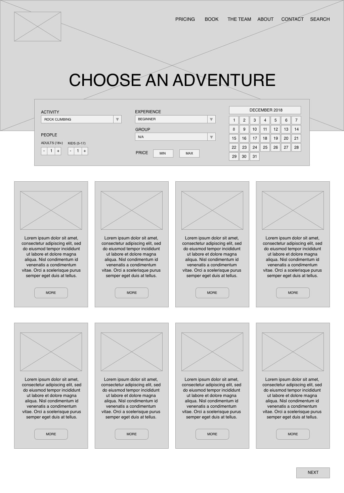

## Planning Data Visualization using the Five Design Sheets Methodology

**Project description:** The [Five Design Sheets (FDS)](http://fds.design) methodology is a structured approach to help plan and evaluate possible data visualizations and designs. 
The dataset used for this project is available at <https://www.kaggle.com/datasets/ananthu017/california-wildfire-incidents-20132020>

### Sheet 1. Brainstorm 

### Sheets 2, 3, 4. Initial Designs

