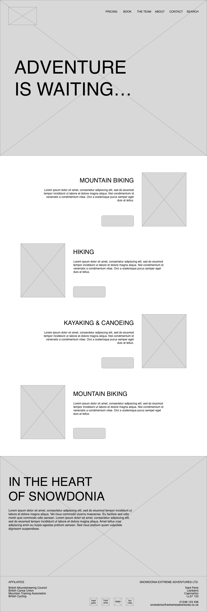
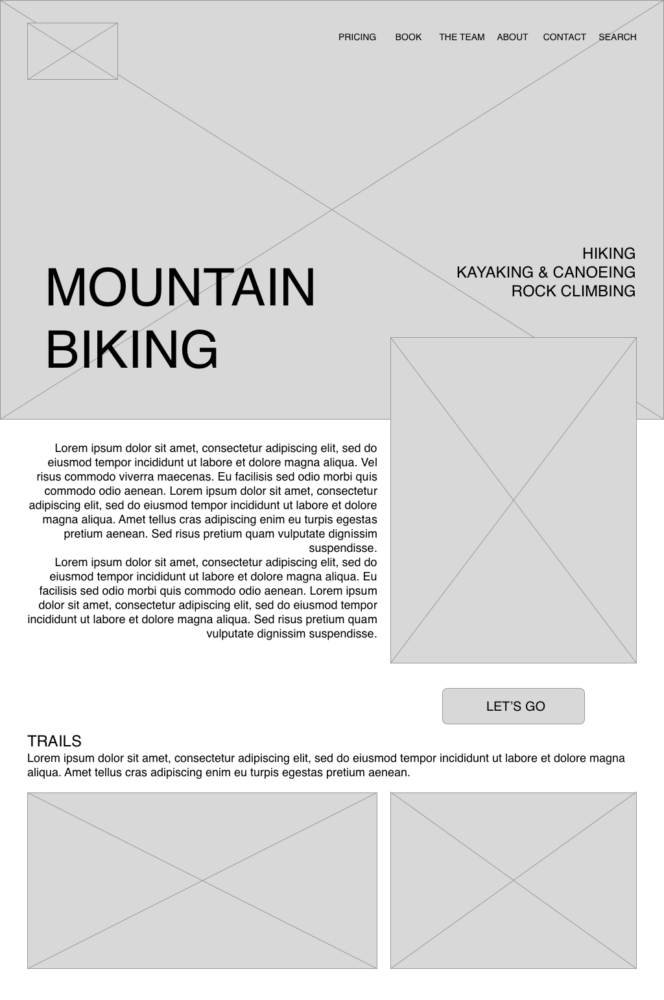

## Adventure Website Design & Mockup

**Project description:** The [Five Design Sheets (FDS)](http://fds.design) methodology is a structured approach to help plan and evaluate possible data visualizations and designs. 
The dataset used for this project is available at <https://www.kaggle.com/datasets/ananthu017/california-wildfire-incidents-20132020>

### 1. Homepage 

### 2. Booking page

### 3. Activity Information page

### 3. Home page Mockup

