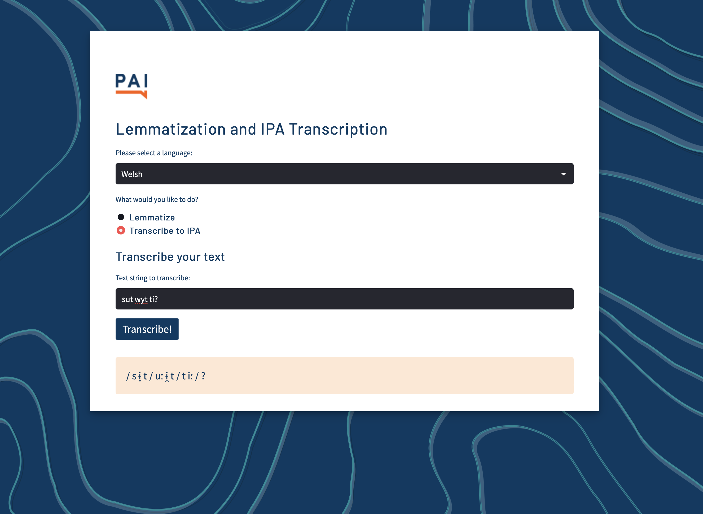

## Lemmatisation & IPA Transcription tool

**Project description:** For this project I used Streamlit to create a tool that allows users to enter a word or phrase and it outputs either the lemmatised text or the IPA transcription of the text entered.

<video width="320" height="240" controls>
  <source src="images/Screen Recording 2024-12-16 at 08.40.37.mov" type="video/mp4">
Your browser does not support the video tag.
</video>